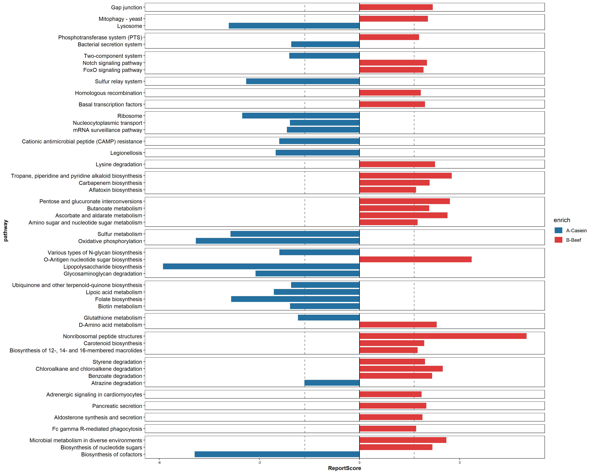

# ReportScore

<!-- badges: start -->
<!-- badges: end -->

The goal of ReportScore is to compute the reportscore of pathway or module

## Installation

This package can be installed using [devtools](http://cran.r-project.org/web/packages/devtools/index.html).

```r
devtools::install_github('rusher321/ReportScore@master')
```

## Example

This is a basic example which shows you how to solve a common problem:

```{r example}
library(ReportScore)

## basic example code
pr <- read.table("test/test.profile.txt",row.names = 1,header = T,sep = "\t")
grp <- read.table("test/test.group.txt",row.names = 1,header = T,sep = "\t")
res <- ReporterScore(pr, grp, paired = T, database = "./database")

## if you want update the datebase 
download_data(db_dir = "database/")

## if you want plot the output
fig <- ReportVis(res, color = c("#2470a0", "#DE3C3C"), exclude = T)

## the **test.R** have real data can to test

```
## Figure 
the output like 

We welcome comments, criticisms, and especially contributions! GitHub
issues are the preferred way to report bugs, ask questions, or request
new features. You can submit issues here:

<https://github.com/rusher321/ReportScore/issues>

ToDo 
-----

- [√]Visualization of reportscore result 
- [ ]parallel compute of multi group 


Meta
----

-   Please [report any issues or
    bugs](https://github.com/rusher321/microbiotaPair/issues).
-   License: MIT
-   Get citation information for `ReportScore` in R doing
    `citation(package = 'ReportScore')`
-   Please note that this project is released with a [Contributor Code
    of Conduct](CONDUCT.md). By participating in this project you agree
    to abide by its terms.
